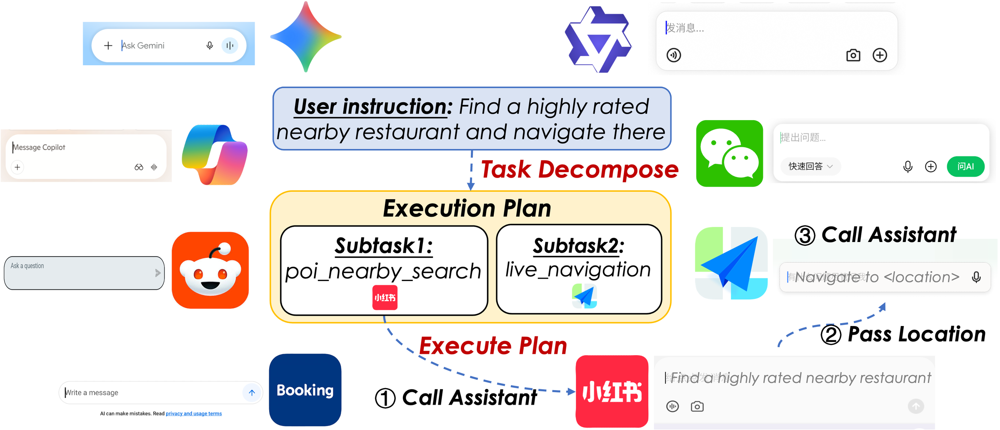
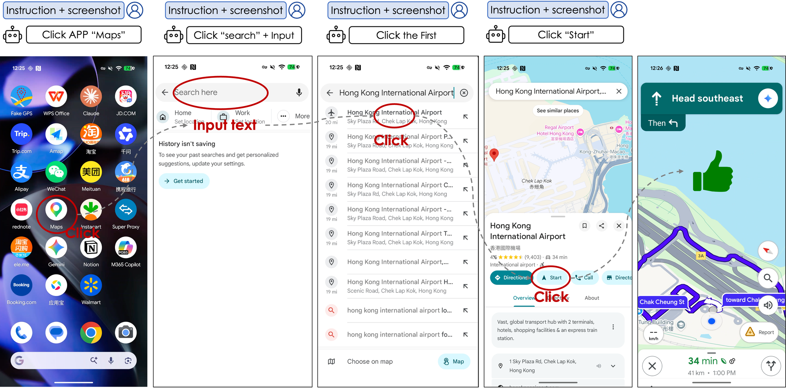
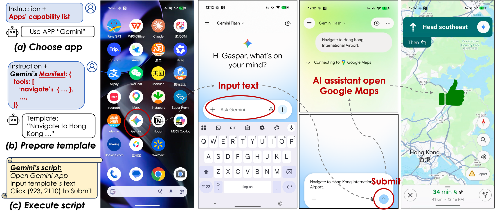
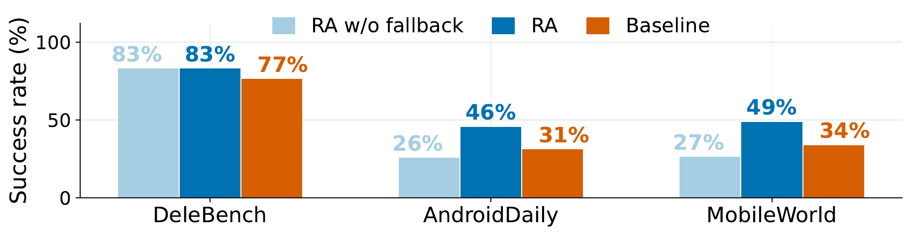
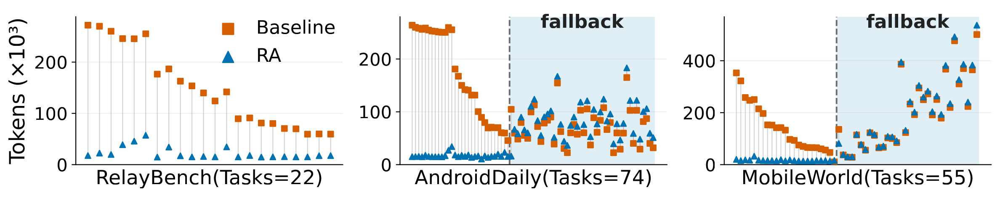

<h1 align="center">RelayAgent</h1>

<p align="center">
  <b>Mobile Task Automation by Delegating Subtasks to In-App AI Assistants</b>
</p>

<p align="center">
  <a href="report/RelayAgent-TechReport.md">📄 Tech Report</a> •
  <a href="#-citation">📚 Paper</a> •
  <a href="android/README.en.md">📱 On-device App</a> •
  <a href="SPEC.md">📋 Spec v0.1</a> •
  <a href="docs/roadmap.md">🗺️ Roadmap</a> •
  <a href="CONTRIBUTING.md">🤝 Contributing</a>
</p>

<p align="center">
  <b>English</b> | <a href="README_zh.md">中文</a>
</p>

<p align="center">
  
  
  
  
</p>

Mobile agents usually automate apps through **vendor APIs** (MCP, A2A, App Intents) or low-level **GUI actions** (Mobile-Agent, AppAgent, AutoGLM). RelayAgent explores a **third substrate**: the **in-app AI assistants** that popular apps already ship — already holding the user's login, address, and payment context. It decomposes a request into app-local subtasks, **delegates each to a suitable assistant via a natural-language instruction**, orchestrates the results across apps, and **falls back to GUI control** where no assistant covers a subtask — so coverage is never worse than a pure GUI agent.

<p align="center">
  
  <br>
  <em>One request, many in-app assistants: the planner decomposes the instruction and delegates each subtask to the app agent that already holds the user's context. <b>Find a nearby restaurant</b> → a discovery assistant; <b>navigate there</b> → a map assistant.</em>
</p>

---

## 📖 About

RelayAgent turns "delegate one task to one app's assistant" into a full cross-app agent architecture. It is built from three pieces:

- **🧭 Delegation-based NL flow.** Decomposes a request into app-local subtasks, routes each to an app, and drives the delegation as deterministic adb actions (cold-launch → entry path → type prompt → scrape reply → hand off), passing results across a shared blackboard — with runtime failure recovery and GUI fallback. *(`agents/flow/`; Spec §5)*
- **📚 A dynamic capability library.** Each app is modeled as a **card** — a schema-validated manifest of its assistant's entry path, capabilities, and **handoff-to-user safety policy** (irreversible actions must `ask_user` first). Capability boundaries are learned from execution to guide routing and fallback. *(`manifests/`; Spec §4)*
- **🧪 The RelayBench benchmark.** 30 long-horizon daily tasks over apps not covered by existing suites. *(`benchmark/`)*

### The third substrate, side by side

|  | Vendor APIs<br>(A2A / App Intents / AppFunctions) | Pure GUI agents<br>(Mobile-Agent, AppAgent, …) | **RelayAgent (ours)** |
| --- | --- | --- | --- |
| Who does the task | the app's exposed API | the agent re-drives the full UI | the app's **own logged-in** in-app assistant |
| Vendor cooperation | **required** | none | **optional** |
| Coverage | narrow (published endpoints only) | any app | any app with an assistant, **GUI fallback otherwise** |
| User context (login, address, payment) | re-provided | re-navigated each run | **already present** |
| Cost / latency per app-local task | low (one call) | **high** (screenshot + VLM + click, per step) | **low** (one NL instruction) |
| Irreversible-action safety | API-level | ad-hoc | **`handoff_to_user_required` contract** |

In 2026 vendors are wiring their *own* assistants into their *own* services (Alibaba's Qwen app now covers Taobao 闪购, Fliggy, and Amap ride-hailing) — which validates the premise while bounding RelayAgent to the **cross-vendor / long-tail gap** that first-party integration never reaches.

<p align="center">
  
  <br>
  <em><b>Pure GUI agent:</b> a screenshot + VLM round-trip every step.</em>
  <br><br>
  
  <br>
  <em><b>Delegation via a card:</b> a deterministic entry script (open → type prompt → submit) hands the task to the in-app assistant.</em>
</p>

## 📊 Evaluation

RelayAgent (**RA** = NL flow with GUI fallback) consistently outperforms a pure-GUI baseline (MobileWorld's `general_e2e`) on all three real-device benchmarks — **AndroidDaily**, **MobileWorld**, and our own **RelayBench**:

- **📈 +6 to +15 pts success rate** — 46 / 49 / 83% vs. 31 / 34 / 77%
- **⚡ 1.8× faster** end-to-end (1.4–2× range)
- **🪙 8.8× fewer LLM tokens** (7–10× range)

<p align="center">
  
</p>

Same Pixel 9 and backbone model; each task run by both systems under identical state with a cold-launch reset, human-judged on trajectory + outcome. Speed/token gains are on tasks completed without fallback; when GUI fallback *is* needed, delegation adds only ~4 s (7%) and ~10 K tokens (5%), because capability boundaries are modeled well enough to avoid useless delegation.

<details>
<summary><b>Per-task token consumption &amp; single-task A/B (Tech Report §8)</b></summary>

<br>

<p align="center">
  
  <br>
  <em>Per-task tokens, paired by task: blue = RelayAgent, orange = GUI baseline. The shaded region is tasks completed via GUI fallback.</em>
</p>

A four-configuration A/B on a real device isolates *what delegation buys* on **T1**, a single-app order for three Mixue drinks. All configs place the same order through the same backend (Taobao 闪购's assistant *is* 千问/Qwen), varying only interaction style. Median tokens, n=3:

| Configuration | Median tokens | vs RA optimized |
| --- | ---: | ---: |
| Pure-VLM, hand-driving native UI | 75 463 | 18.9× |
| Pure-VLM, *using* the in-app assistant (`general_e2e`) | 77 347 | 19.4× |
| RelayAgent, optimizations off (baseline) | 9 585 | 2.4× |
| **RelayAgent, optimized** | **3 986** | **1×** |

- **Structured delegation** wins against a pure-VLM agent driving the *same* assistant because it removes per-step VLM re-driving — concretely **~1 screenshot vs ~30** (≈97–99% image-prompt tokens). A manifest-free delegation relay lands in between, attributing the gap to **mostly delegation, manifest secondary** (§8.9).
- **Two app-agnostic optimizations** (a two-stage reply-completion precheck + an a11y-scrape-first text path) add a further **2.4×** over the un-optimized delegation baseline (§7).
- **Predictability is itself a result.** RA's per-task cost is nearly constant (T1 **3987 / 3986 / 3950** tokens, VLM calls fixed at 2), while the pure-VLM agent varied **38k → 97k tokens at 46 → 379 s** on the identical task. In dollars: RA ~**$0.001/task** vs. ~**$0.016** for the pure-VLM agent (16.6×).
- **Safety held.** Every `handoff_to_user_required` run stopped before the irreversible CTA with zero confirm taps; **28/28 capabilities** across 7 cards reached their expected terminal state (§8.2.1).

Full method, threats-to-validity, and frozen data: [Tech Report](report/RelayAgent-TechReport.md) and `report/benchmark-data-n3.md`.

</details>

## 🎬 Demo

**Single-app order** — *"帮我点三杯蜜雪冰城蜜桃四季春，温度和糖度都用默认"* → the 千问 (Qwen) in-app assistant assembles a 3-cup cart and **stops at the payment screen** for the user to confirm (the handoff contract in action).

<p align="center">
  
</p>

## 🗂️ Project Structure

```
RelayAgent/
├── SPEC.md                    # manifest specification (v0.1)
├── SPEC-OPEN-QUESTIONS.md     # known design questions still in flight
├── spec/                      # schema.json (manifest) + profile.schema.json (user memory)
├── manifests/                 # one YAML card per app; 10 Android cards, 50 capabilities
├── agents/                    # device backends, LLM client, runtime loop, routing, relay adapter, NL flow
│   ├── device/                #   DeviceBackend abstraction (Android adb; iOS/HarmonyOS seams)
│   ├── llm/ · runtime/        #   provider client + retries; process entry + device loop
│   ├── routing/ · agent/      #   capability/card routing; in-app VLM agent + action layer
│   └── flow/                  #   NL cross-app flow: planner, runner, leg judge, recovery
├── scripts/                   # run_plan.py (NL flow), benchmark runner, validation, metrics
├── android/                   # on-device app: the full NL flow on the phone, no computer, no adb
├── benchmark/                 # task sets (incl. RelayBench) for the A/B benchmark
├── tests/                     # device-less unit tests (CI)
├── docs/                      # design docs — see Documentation below
├── report/                    # tech report + frozen benchmark data
└── LICENSE                    # Apache-2.0
```

## 🚀 Quick Start

```bash
git clone https://github.com/ShadowNearby/RelayAgent.git && cd RelayAgent
uv venv --python 3.12 && uv sync --no-install-project --extra dev
cp .env.example .env          # then fill in LLM_BASE_URL / LLM_API_KEY / LLM_MODEL
uv run python -m agents.runtime.native_runner com.aliyun.tongyi "帮我点三杯蜜雪冰城蜜桃四季春"
```

That's the whole loop: it loads `.env`, activates the AdbKeyboard IME, cold-launches the target app, and drives the goal over direct adb. The steps, explained:

### 1. Environment setup

RelayAgent is pure Python — **no server, no framework cold-start**. Requires **Python 3.12** on a Linux/WSL host; run the sources directly via `uv run` (don't install the project). Optional extras: `--extra stream` (scrcpy streaming capture), `--extra mw` (MobileWorld A/B baseline).

### 2. Mobile device setup

An Android phone over USB debugging (or an emulator — see [emulator testing](docs/emulator_testing.md)) with `com.android.adbkeyboard/.AdbIME` installed. Full device prep + per-benchmark app requirements: [device setup](docs/device_setup.md).

```bash
uv run python scripts/validate/check_device_env.py    # pre-flight: device / IME / uiautomator / screencap / app install state
```

### 3. Model configuration

Copy `.env.example` to `.env` and fill in an OpenAI-compatible VLM endpoint (`LLM_BASE_URL` / `LLM_API_KEY` / `LLM_MODEL`). The VLM is **provider-agnostic** — Qwen-VL, Claude, Gemini, Kimi, … — and used sparingly per task (this is the source of the token numbers above).

### 4. Run it

The TL;DR command above is the **single-app** entry point: `python -m agents.runtime.native_runner <pkg> "<goal>"` cold-launches one target package and drives one goal over an in-process `obs → predict → execute` loop.

For a **natural-language cross-app flow**, use `run_plan.py` — it synthesizes a flow, routes each leg through the matrix-backed router, previews, then executes (runtime failure recovery + coverage fallbacks + user-memory profile on by default):

```bash
uv run python scripts/run_plan.py --yes     "帮我点三杯蜜雪冰城蜜桃四季春"
uv run python scripts/run_plan.py --yes     "帮我找一台适合学生的平板电脑，预算2000以内"
uv run python scripts/run_plan.py --dry-run "把这段材料整理成一份中文总结文档"
```

The adapter honors `handoff_to_user_required`: for any irreversible capability it emits `ask_user` before the terminal CTA rather than auto-confirming.

<details>
<summary><b>Useful env knobs</b> (full list in <code>.env.example</code>)</summary>

<br>

| Knob | Effect |
| --- | --- |
| `RELAY_CAPTURE_BACKEND=scrcpy` | Streaming frame capture (~1.5 s → ~8 ms/frame; needs `--extra stream` + scrcpy on the host). Any failure falls back to `screencap` permanently. |
| `RELAY_PRECHECK=0 RELAY_SCRAPE=0` | Disable the two reply-path optimizations (reproduces the benchmark baseline). |
| `RELAY_RECOVERY=0` | Turn off runtime failure recovery. |
| `--no-general-fallback` / `--no-mw-fallback` | Disable coverage fallbacks for `run_plan.py`. |
| `RELAY_PROFILE=0` | Disable the user-memory profile layer. |
| `RELAY_ANDROID_SERIAL=...` | Pin every adb call to one device in multi-device setups. |
| `RELAY_MANIFESTS=/path` | Override the default `./manifests/`. |

</details>

### Run tests

```bash
uv run python -m unittest discover -s tests -v            # device-less; planner/runner unit tests, no adb needed
uv run python scripts/validate/validate_manifests.py      # manifest schema + prompt_template rules (CI gate)
```

Real-device A/B benchmark: `scripts/run_benchmark_test.py`. `test-results/` and `traj_logs/` are gitignored — do not commit trajectories containing user data.

## 📱 On-device App

The whole pipeline — routing, planning, leg execution, logging — also runs inside a **standalone Android app** via an accessibility service and Chaquopy-embedded Python: **no computer, no adb**. Chat-style task thread, live run cards, structured run-log viewers, zh locale + dark theme. Host behavior is preserved bit-for-bit; only the Android-side implementation swaps in. See [`android/`](android/README.en.md).

## 📚 Documentation

| Document | Description |
| --- | --- |
| [NL cross-app flow](docs/nl_flow.md) | The core architecture: synthesis, three-stage routing, leg judge, failure recovery, coverage fallbacks |
| [Manifest conventions](docs/manifest_conventions.md) | Authoring cards: language convention, `prompt_template`, `x_capture_full_reply`, key capability fields |
| [Device setup](docs/device_setup.md) / [Emulator testing](docs/emulator_testing.md) | Real-device prep; AVD setup + remote observation |
| [Roadmap](docs/roadmap.md) | Productization phases P1–P5 with acceptance metrics (P1–P3 shipped) |
| [On-device app](android/README.en.md) | The Android app: architecture, host↔device seams, UI |

## 📇 Supported reference cards

**10 verified Android apps · 50 declared capabilities** (Amap, Tongyi Qwen, Ctrip, Gemini, Xiaohongshu, WeChat, WPS, Reddit, Booking.com, Microsoft Copilot). Full table, capabilities, and quality bar: **[docs/cards.md](docs/cards.md)**. Submitting a card: [CONTRIBUTING.md](CONTRIBUTING.md).

## 🚧 What this project is *not*

- **Not a GUI agent.** We navigate to an in-app assistant's input field, not the app's general UI. For general GUI agents, see Mobile-Agent / AppAgent / AutoGLM.
- **Not a scraper.** Cards describe entry paths and capabilities, not data extraction.
- **Not affiliated with any phone OEM or app vendor.** Neutral community spec — vendors may publish official cards or not; the community can write one either way.
- **Not a challenger to A2A or MCP.** Forward-compatible by design (Spec §14). When apps ship A2A, cards become a thinner shim or disappear.

> **Known blocker.** The Taobao-hosted shopping capabilities (now routed through the 千问/Qwen card, since Taobao's in-app assistant *is* 千问) may hit server-side risk control ("亲，访问被拒绝") on the deep-link target page — an account/device-level 风控 wall, **not** an adapter or manifest bug. Mitigations: use an account with normal purchase history and clear pending real-name / device-trust checks.

## 📚 Citation

If you find RelayAgent useful, please cite the paper and this repository:

```bibtex
@misc{relayagent2026,
  title        = {RelayAgent: Mobile Task Automation by Delegating Subtasks to In-App AI Assistants},
  author       = {Yan, Jingsheng and Wu, Fangnuo and Dong, Mingkai and Chen, Haibo},
  year         = {2026},
  howpublished = {\url{https://github.com/ShadowNearby/RelayAgent}},
  note         = {Preprint; arXiv release upcoming}
}
```

## 🙏 Acknowledgements

- [**MobileWorld**](https://github.com/Tongyi-MAI/MobileWorld) (Tongyi MAI) — one of our three evaluation benchmarks, and the source of the `general_e2e` pure-GUI baseline used in the A/B comparison.
- **AndroidDaily** — the everyday-task benchmark (32 Chinese apps) used in the full-system evaluation.

## 📄 License

Apache-2.0. See [LICENSE](LICENSE). Chosen for permissive enterprise use — the design only works if phone OEMs can adopt it without legal friction.
