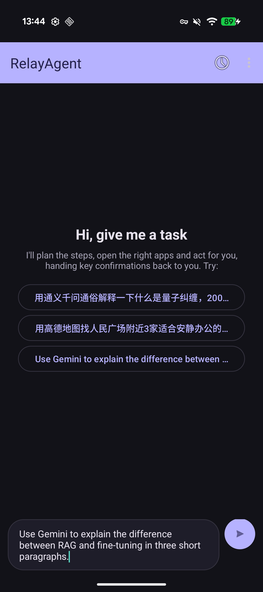

<h1 align="center">RelayAgent</h1>

<p align="center">
  <b>Mobile Task Automation by Delegating Subtasks to In-App AI Assistants</b>
</p>

<p align="center">
  <a href="#-citation">📚 Paper</a> •
  <a href="android/README.en.md">📱 Android App</a> •
  <a href="docs/roadmap.md">🗺️ Roadmap</a> •
  <a href="CONTRIBUTING.md">🤝 Contributing</a>
</p>

<p align="center">
  <b>English</b> | <a href="README_zh.md">中文</a>
</p>

<p align="center">
  
  
  
  
</p>

RelayAgent is a mobile agent that completes tasks end-to-end by **delegating subtasks to in-app assistants** (e.g. Qwen's assistant, Xiaohongshu's Dot, WeChat's AI assistant).

<p align="center">
  
  <br>
  <em>RelayAgent architecture: the task is first decomposed, then each subtask is delegated to the corresponding in-app assistant.</br><b>Find a top-rated nearby restaurant</b> → Xiaohongshu's assistant; <b>navigate there</b> → Amap's assistant.</em>
</p>

---

## 📖 About

RelayAgent is built from three pieces:

- **🧭 A delegation-based execution flow.** Decomposes a request into app-local subtasks, routes each subtask to the corresponding in-app assistant; when no assistant can complete a subtask, a screenshot-driven GUI agent steps in as a fallback.
- **📚 Dynamic capability cards.** Models each in-app assistant as a capability card (a YAML manifest) describing how to invoke it and the boundaries of what it can do, which drives subtask routing.
- **🧪 RelayBench.** A self-built on-device agent test suite of 30 long-horizon daily tasks, focused on apps and capabilities not covered by existing test suites.

### Compared with vendor APIs and pure GUI agents

|  | Vendor APIs<br>(A2A / App Intents / AppFunctions) | Pure GUI agents<br>(Mobile-Agent, AppAgent, …) | RelayAgent (ours) |
| --- | --- | --- | --- |
| Who does the task | the app's exposed API | agent-driven simulation of user actions | in-app assistant + agent-driven simulation of user actions |
| Vendor cooperation required | required | none | none |
| Coverage | narrow (published endpoints only) | any app | any app |
| Cost / latency per app-local task | low | high | low |

<p align="center">
  
  <br>
  <em>Pure GUI agent: a screenshot + VLM round-trip every step</em>
  <br><br>
  
  <br>
  <em>RelayAgent: delegates the task to the in-app assistant</em>
</p>

## 📊 Results

RelayAgent outperforms a pure GUI agent baseline (MobileWorld's `general_e2e`) on all three test suites (AndroidDaily, MobileWorld, RelayBench):

- Success rate up 6–15 points
- End-to-end speed ~1.4–2× the baseline
- Token consumption ~1/7–1/10 of the baseline

<p align="center">
  
  <br>
  <em>Task completion rate. Light blue = RelayAgent without fallback, blue = RelayAgent, orange = GUI agent baseline</em>
  <br><br>
  
  <br>
  <em>Task completion time. Blue = RelayAgent, orange = GUI agent baseline; the shaded region is tasks completed via GUI-agent fallback.</em>
  <br><br>
  
  <br>
  <em>Task token consumption</em>
</p>

## 🎬 Demo

*"帮我点三杯蜜雪冰城蜜桃四季春，温度和糖度都用默认"* (Order three Mixue drinks, defaults for temperature and sweetness) → the task is delegated to Qwen's in-app assistant, which places the order and stops at the payment screen.

<p align="center">
  
</p>

## 🚀 Quick Start

An Android phone with USB debugging enabled (current capability cards only support Google Pixel 9) or an emulator, with the ADB Keyboard IME (`com.android.adbkeyboard/.AdbIME`) installed and enabled. See [device setup](docs/device_setup.md) and [emulator testing](docs/emulator_testing.md).

```bash
git clone https://github.com/ShadowNearby/RelayAgent.git && cd RelayAgent
uv venv --python 3.12 && uv sync --no-install-project --extra dev
cp .env.example .env
# fill in LLM_BASE_URL / LLM_API_KEY / LLM_MODEL in .env
uv run python scripts/validate/check_device_env.py    # check the runtime environment
uv run python scripts/run_plan.py --yes     "帮我点三杯蜜雪冰城蜜桃四季春"
```

### Run tests

```bash
uv run python -m unittest discover -s tests -v            # device-less unit tests
uv run python scripts/run_benchmark_test.py               # requires a device; runs the end-to-end A/B benchmark (baseline + RelayAgent)
```

## 📱 Android App

The full pipeline — planning, routing, execution, logging — also runs inside a standalone **Android app**, see [`android/`](android/README.en.md).

<p align="center">
  
</p>

## 📚 Documentation

- [Core flow architecture](docs/nl_flow.md)
- [Capability card conventions](docs/manifest_conventions.md)
- [Real-device setup](docs/device_setup.md) / [Emulator setup](docs/emulator_testing.md)
- [Roadmap](docs/roadmap.md)
- [Android App](android/README.en.md)

## 📇 Supported reference capability cards

10 apps · 50 in-app assistant capabilities (Amap, Tongyi Qwen, Ctrip, Gemini, Xiaohongshu, WeChat, WPS, Reddit, Booking.com, Microsoft Copilot). See [docs/cards.md](docs/cards.md) for details.

## 📚 Citation

If you find RelayAgent useful, please cite the paper and this repository:

```bibtex
@misc{relayagent2026,
  title        = {RelayAgent: Mobile Task Automation by Delegating Subtasks to In-App AI Assistants},
  author       = {Yan, Jingsheng and Wu, Fangnuo and Dong, Mingkai and Chen, Haibo},
  year         = {2026},
  howpublished = {\url{https://github.com/ShadowNearby/RelayAgent}},
  note         = {Preprint; arXiv release upcoming}
}
```

## 🙏 Acknowledgements

- [**MobileWorld**](https://github.com/Tongyi-MAI/MobileWorld) (Tongyi MAI) — one of the test suites used, and the source of the GUI agent baseline.
- **AndroidDaily** — one of the test suites used.

## 📄 [LICENSE](LICENSE)
