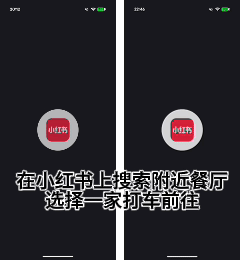
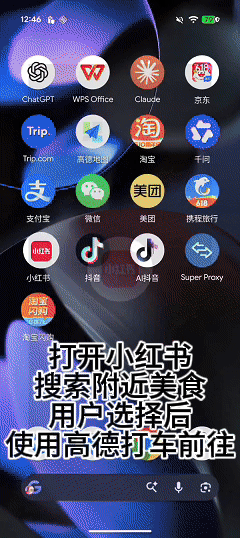

# RelayAgent

<p align="center">
  <a href="report/RelayAgent-TechReport.md">Tech Report</a> •
  <a href="SPEC.md">Spec (v0.1)</a> •
  <a href="CONTRIBUTING.md">Contributing</a> •
  <a href="https://github.com/ShadowNearby/RelayAgent/issues">Issues</a>
</p>

<p align="center">
  
  
  
  
</p>

**A discovery layer for delegating a user's request to the AI agent that already lives inside a mobile app** — so that an OS-level agent (HarmonyOS 小艺, Apple Intelligence, …) can hand a task to the in-app agent that already holds the user's account, address, and payment context, instead of re-driving the whole UI itself or waiting for the vendor to publish an endpoint.

One machine-readable **card** per app. GUI-mediated by default. Vendor-cooperation-*optional*.

> **Status:** early but measured. SPEC v0.1, seven verified Android reference cards (28 capabilities), a MobileWorld relay adapter, multi-app flow runner, and a real-device A/B benchmark. Full method and numbers: [**Tech Report**](report/RelayAgent-TechReport.md). Contributors welcome.

<p align="center">
  
  <br>
  <em>Same task — <em>search nearby restaurants on Xiaohongshu, pick one and hail a ride there</em>. <strong>Left: RelayAgent</strong> delegating to the in-app assistant. <strong>Right: a pure-VLM agent</strong> hand-driving the native UI. Playback is 4× speed; wall-clock to completion: <strong>RelayAgent 86 s vs pure-VLM 131 s</strong>. See §Results for the token numbers.</em>
</p>

---

## The third path

An OS-level agent that wants to *act inside* a third-party super-app has had two options, both of which break down in the open ecosystem:

- **Vendor-cooperation APIs** — A2A, Apple App Intents / Shortcuts, Android AppFunctions, HarmonyOS HMAF. Clean and typed, but gated on the *vendor* publishing an endpoint. The long tail — and most Chinese super-apps — never do.
- **Pure GUI agents** — Mobile-Agent, MobiAgent, AppAgent, AutoGLM, … drive the full UI from screenshots, step by step. Brittle, slow, detectable, legally gray, and *wasteful*: they re-derive login, location, and payment state the app already has.

The observation behind RelayAgent: most super-apps **already ship their own logged-in AI agent** — Amap's assistant tab, Yuanbao in WeChat, Taobao/闪购's shopping assistant, Xiaohongshu's 点点, WPS AI. For a large fraction of real intents, the capability the user wants *already exists, already logged in, already holding the user's context* inside the app.

So we argue for a **third path: delegate the user's intent to the app's own embedded agent** — rather than re-implementing the task (pure GUI agents) or waiting for an endpoint (A2A). What that needs is not a smarter automation model but a *contract*: a per-app discovery layer telling the OS agent which apps embed an agent, where its input box is, what it can do, and — critically — **when control must return to the user.**

| | Vendor APIs<br>(A2A / App Intents / HMAF) | Pure GUI agents<br>(Mobile-Agent, MobiAgent, …) | **RelayAgent (ours)** |
| --- | --- | --- | --- |
| Who does the task | the app's exposed API | OS agent re-drives the full UI | the app's **own logged-in** in-app agent |
| Vendor cooperation | **required** | none | **optional** |
| User context (login, address, payment) | re-provided | re-navigated each run | **already present** |
| Irreversible-action safety | API-level | ad-hoc | **`handoff_to_user_required` contract** |
| Cost predictability | high | **low** (high run-to-run variance) | **high** (near-identical) |

A neighbor is emerging fast in 2026: vendors wiring their *own* assistant into their *own* services (Alibaba's Qwen app has absorbed Taobao 闪购, Fliggy, and Amap ride-hailing). This **validates the premise** — in-app assistants really do complete real, logged-in transactions — and **bounds our niche**: such integration is first-party and intra-ecosystem. RelayAgent targets the **cross-vendor / long-tail gap** that no super-assistant reaches. Where first-party integration *does* exist, RelayAgent defers to it. (Full positioning: Tech Report §2.)

## How it works — three pieces

1. **Discovery — the card.** A per-app YAML manifest (`manifests/*.yaml`, JSON-Schema-validated by `spec/schema.json`) describing the launcher entry path into the embedded agent, its capabilities, example prompts, latency hints, and handoff policy. *(Spec: §4.)*
2. **Access — the relay adapter.** `agents/relay_agent.py` materializes a card into deterministic device actions under [MobileWorld](https://github.com/Tongyi-MAI/MobileWorld): cold-launch → walk the entry path → type the prompt → wait for the reply → scrape it → hand off. Accessibility-tree-first, provider-agnostic across VLMs. *(§5.)*
3. **Safety — the handoff contract.** A capability marked `handoff_to_user_required: true` *must* emit an `ask_user` and return control **before any irreversible action** — payment, ride confirmation, order submission. The in-app agent does the reversible preparation; the human authorizes the irreversible step. *(§4.1.)*

### A card in use

```
user: "Call an economy car to the airport"
        │
        ▼
OS-level agent
  1. receives an explicit target app, e.g. com.autonavi.minimap
  2. matches the request against the card's capabilities → picks `hail_ride`
  3. follows card.entry → opens Amap, taps the AI tab, flips it to text mode
  4. types the user's original prompt into the chat input
  5. honors `handoff_to_user_required: true` — returns control before the 立即打车 CTA
        │
        ▼
Amap's in-app assistant does the actual work (it already knows the user)
```

The target app is **explicit**. The OS agent selects a capability within it. The in-app agent acts. The card is the contract.

## Demo

Two real-device end-to-end runs (these are the trajectories behind the benchmark in §8.8):

**T1 — single-app order.** *"帮我点三杯蜜雪冰城蜜桃四季春，温度和糖度都用默认"* → the 千问 (Qwen) in-app assistant assembles a 3-cup cart and stops at the payment screen for the user to confirm.


**T2 — cross-app flow.** One NL sentence, *"在上海找三家评价好的小众书店，挑一家打车过去"*, routed to the [`xhs_to_amap_place`](manifests/_flows/xhs_to_amap_place.yaml) flow: Xiaohongshu's 点点 returns three bookstores, the user picks one, and Amap's voice tab takes the pick straight into a ride card — stopping before the final CTA.



```bash
uv run python scripts/run_nl.py "在上海找三家评价好的小众书店，挑一家打车过去" --record
```

## Results

A four-configuration A/B on a real device (Tech Report §8) isolates *what delegation buys*. Two tasks: **T1** order three Mixue drinks (single app); **T2** discover-then-ride across Xiaohongshu + Amap. For T1 all configs place the **same order through the same backend** (Taobao 闪购's assistant *is* 千问), varying only interaction style. Median tokens, n=3 for the RelayAgent / pure-VLM configs:

**T1 — order_food**

| Configuration | Median tokens | vs RA optimized |
| --- | ---: | ---: |
| Pure-VLM, hand-driving native UI | 75 463 | 18.9× |
| Pure-VLM, *using* the in-app assistant (`general_e2e`) | 77 347 | 19.4× |
| RelayAgent, optimizations off (baseline) | 9 585 | 2.4× |
| **RelayAgent, optimized** | **3 986** | **1×** |

**T2 — cross-app flow (xhs → amap)**

| Configuration | Median tokens | vs RA optimized |
| --- | ---: | ---: |
| Pure-VLM, hand-driving native UI | 294 695 | 34.0× |
| Pure-VLM, *using* the in-app assistant (`general_e2e`) | 95 296 | 11.0× |
| RelayAgent, optimizations off (baseline) | 31 174 | 3.6× |
| **RelayAgent, optimized** | **8 662** | **1×** |

Reading the gradients:

- **Using the in-app assistant at all** pays off *in proportion to task complexity* — flat on the shallow order (T1, +2.5%) but **−68%** on the discovery-heavy flow (T2, where 23 native-UI steps collapse to 7 assistant turns). A re-driving agent only banks this on the heavy task.
- **Structured delegation (RelayAgent)** wins on **both**: **19.4×** (T1) and **11.0×** (T2) vs. the pure-VLM agent driving the *same* assistant — because it removes per-step VLM re-driving, which is paid regardless of complexity. The gap is concretely **~1 screenshot vs ~30** (the cost is ~97–99% image-prompt tokens). A manifest-free delegation relay lands in between, attributing the gap to **mostly delegation, manifest secondary** (§8.9).
- **Two app-agnostic optimizations** (a two-stage reply-completion precheck + an a11y-scrape-first text path) add a further **2.4× / 3.6×** over the un-optimized delegation baseline (§7).

**Predictability is itself a result.** RelayAgent's per-task cost is nearly constant — T1 **3987 / 3986 / 3950** tokens (VLM calls fixed at 2) — while the pure-VLM agent varied **38k → 97k tokens at 46 → 379 s** on the identical task (all three reaching the same pre-payment screen), with premature-exit and runaway-loop tails seen in earlier exploration. A predictable ~4k beats a several-fold spread for anyone paying per token. Restated in dollars (§8.2), RelayAgent optimized is ~**$0.001/task** vs. ~**$0.016** for the pure-VLM agent (16.6×).

**Safety held.** Every `handoff_to_user_required` run stopped before the irreversible CTA — the food order at `立即支付`, the ride at `立即打车` — with zero confirm taps. Functional coverage: **28/28 capabilities** across the 7 cards reached their expected terminal state (§8.2.1).

> Numbers are the 2026-06-02 n=3 re-run; full method, threats-to-validity, and frozen data are in the [Tech Report](report/RelayAgent-TechReport.md) and `report/benchmark-data-n3.md`.

## What's in the repo

```
RelayAgent/
├── SPEC.md                    # manifest specification (v0.1)
├── SPEC-OPEN-QUESTIONS.md     # known design questions still in flight
├── spec/schema.json           # JSON Schema mirror of SPEC (normative validator)
├── manifests/                 # one YAML card per app; 7 Android cards + _flows/ for multi-app YAMLs
├── agents/                    # relay adapter, planner, capability router, card loader, flow runner, adb helper
├── scripts/                   # run_test.py (single app), run_flow.py (hand-written multi-app flow), run_nl.py (NL routing), run_plan.py (auto-synthesized cross-app plan)
├── report/                    # tech report + frozen benchmark data
├── CONTRIBUTING.md
└── LICENSE                    # Apache-2.0
```

## Run under MobileWorld (multi-VLM real-device runner)

`agents/relay_agent.py` plugs RelayAgent into [MobileWorld](https://github.com/Tongyi-MAI/MobileWorld) as an `--agent-type`. MobileWorld provides a real-device runner with provider-agnostic VLM support (Claude, Gemini, Qwen-VL, Kimi, …); the card supplies the deterministic entry path and handoff policy.

Requires **Python 3.12** (MobileWorld pins `>=3.12,<3.13`) and a Linux/WSL host with adb + a USB-debugging phone running `com.android.adbkeyboard/.AdbIME`.

```bash
# 1. set up the venv. MobileWorld is declared as a git dep in pyproject.toml
#    via [tool.uv.sources]; uv sync clones + installs it automatically.
#    pydantic is pinned <2.11 (fastmcp 2.9.2 incompatibility), so no manual pin needed.
uv venv --python 3.12
uv sync --no-install-project

# 2. fill in .env (LLM_BASE_URL / LLM_API_KEY / LLM_MODEL), then drive a goal
uv run python scripts/run_test.py com.aliyun.tongyi "帮我点三杯蜜雪冰城蜜桃四季春"
```

`scripts/run_test.py` loads `.env`, cold-launches the target app via `agents/_adb.py` (force-stop + monkey LAUNCHER), sets `RELAY_SKIP_OPEN_APP=1` so the planner skips its own `open_app` step, **auto-starts/reuses a persistent MobileWorld server** on port 6800, and forwards any extra flags (e.g. `--max-step 40`) straight through to `mw test`.

If you prefer to call `mw test` yourself, pass the LLM config explicitly:

```bash
set -a; source .env; set +a
export RELAY_TARGET_APP=com.aliyun.tongyi
uv run mw test "帮我点三杯蜜雪冰城蜜桃四季春" \
    --agent-type   "$PWD/agents/relay_agent.py" \
    --model_name   "$LLM_MODEL" \
    --llm_base_url "$LLM_BASE_URL" \
    --api_key      "$LLM_API_KEY"
```

`--model_name` is provider-agnostic — point it at any OpenAI-compatible VLM (`qwen/qwen3-vl-235b-a22b`, `anthropic/claude-sonnet-4-5`, `google/gemini-3`, …). Per task, the VLM is used sparingly (this is the source of the §8 cost numbers):

- 1 text-only LLM call to pick a capability from the card.
- For each text selector, `uiautomator dump` is tried first (precise, zero-token); a small VLM grounding call only on miss.
- `wait_for_reply` polls a VLM (`{done, text}`) on a wall-clock budget (`max(5×typical_latency, 60)` s). A two-stage precheck (screenshot perceptual hash → a11y-tree text hash) skips the VLM entirely while the reply is still streaming.
- Reply text is **scraped from the a11y dump**, not read out of the VLM response; the VLM only judges `done`. For `x_capture_full_reply` capabilities every scroll-frame extract is a scrape too.
- Card `x_bounds` coordinates are a last-resort fallback when the a11y tree doesn't expose the element.

Optional env vars (full list in `.env.example`):

- `RELAY_MANIFESTS=/path/to/manifests` — override the default `./manifests/`.
- `RELAY_TARGET_DENSITY=480` — your phone's DPI for dp-aware `x_bounds` remapping (else raw bi-axial scaling).
- `RELAY_PRECHECK=0 RELAY_SCRAPE=0` — disable the two §7 optimizations (reproduces the benchmark baseline).
- `RELAY_TIMING=1` — write a per-run `wall_clock.json`.
- `RELAY_FRESH_CONV=0` — keep the previous conversation across runs (default starts fresh).
- `RELAY_ANDROID_SERIAL=...` — pin every adb call to one device in multi-device setups.

The adapter honors `handoff_to_user_required`: for any irreversible capability it emits `ask_user` before the terminal CTA rather than auto-confirming.

### Multi-app flows

`scripts/run_flow.py` runs a YAML flow that chains multiple app cards — each step cold-launches one app, pins a single capability, captures the in-app agent's reply, and feeds it forward to the next step via a small text-LLM `extract` call. Two reference flows live under `manifests/_flows/`:

```bash
# Xiaohongshu (POI discovery) → Amap (ride hailing)
uv run python scripts/run_flow.py manifests/_flows/xhs_to_amap_place.yaml \
    --input category="独立书店" --input city=北京

# Or pass a natural-language request and let the LLM fill flow inputs:
uv run python scripts/run_flow.py manifests/_flows/xhs_to_amap_place.yaml \
    --nl "在北京找三家独立书店，挑一家打车过去"

# WeChat (chat summary) → WPS (doc generation)
uv run python scripts/run_flow.py manifests/_flows/wechat_to_wps_summary.yaml
```

### Natural-language entry point

`scripts/run_nl.py` takes a single NL sentence, builds a catalog of all cards + flows, and asks the text LLM to pick the best executor (single-app capability or multi-app flow) before dispatching. Use `--dry-run` to inspect the routing decision without launching anything.

```bash
uv run python scripts/run_nl.py "帮我点三杯蜜雪冰城蜜桃四季春"
uv run python scripts/run_nl.py "在北京找三家独立书店，挑一家打车过去"
uv run python scripts/run_nl.py --dry-run "把和老王的聊天总结成一份周报 docx"
```

### Auto-synthesize a cross-app plan

`run_nl.py` can only *pick* among the flows that already exist. When no flow matches, `scripts/run_plan.py` asks the LLM to **synthesize** a fresh cross-app plan (steps + cross-leg `bind`s) from the full app/capability catalog, validates it locally, persists it to `manifests/_generated/`, previews + confirms, then runs it through the same `FlowRunner`. The generated plan uses the same schema as the hand-written flows.

```bash
# synthesize → preview → ask y/N → execute
uv run python scripts/run_plan.py "在上海找三家评价好的小众书店，挑一家打车过去"

# plan + preview only, don't execute (no device involved)
uv run python scripts/run_plan.py "在上海找三家评价好的小众书店，挑一家打车过去" --dry-run
```

Full design and usage: [`docs/cross_app_planner_en.md`](docs/cross_app_planner_en.md).

## Run tests

```bash
uv pip install .
python -m unittest discover -s tests -v              # device-less discovery; real-device tests skip without adb
```

Real-device tests require a connected Android device with target apps installed and `com.android.adbkeyboard/.AdbIME` enabled. Opt in via `tests/config_local.py` (gitignored):

```python
RUN_REAL_ADB_TESTS = True
```

```bash
python -m unittest tests.test_manifest_real_adb -v
```

Copy `.env.example` to `.env` and fill in your values (LLM endpoint required; `ADB` path optional). See `tests/config.py` for real-device knobs (trajectory capture, result timeouts, screen recording). `test-results/` is gitignored — do not commit trajectories containing user data.

## MVP scope (v0.1)

Seven verified reference cards, **28 capabilities** total, each exercised end-to-end to its terminal state (Tech Report §8.2.1):

| App | Package | Capabilities | Card class |
| --- | --- | --- | --- |
| Amap (高德地图) | com.autonavi.minimap | POI search, navigation, ride hailing, trip planning | mixed |
| Tongyi Qwen (通义千问) | com.aliyun.tongyi | chat, train/ride/food/hotel/movie booking, product search/comparison/purchase/order tracking | mixed |
| Ctrip (携程旅行) | ctrip.android.view | flights, hotels, trains, attractions, package tours | mixed |
| Xiaohongshu (小红书) | com.xingin.xhs | community UGC Q&A via AI search | multi-node |
| WeChat (微信) | com.tencent.mm | Yuanbao chat surface, AI search | mixed |
| WPS Office | cn.wps.moffice_eng | AI doc / PPT / writing assist | single-bubble |

*Card class* (single-bubble TextView vs. multi-node RecyclerView) drives the reply-extraction strategy — see Tech Report §4 / §5.4.

Quality bar per card: all required SPEC fields populated, ≥2 real example prompts per capability, verified manually within 30 days of submission, `handoff_to_user_required` correct for every irreversible capability.

## Known blockers

- **Taobao server-side risk control ("访问被拒绝").** The Taobao shopping capabilities are now hosted in the 千问 (Qwen) card and routed through the Taobao backend — the standalone `com.taobao.taobao` card has been retired, since Taobao's in-app assistant *is* 千问 and the Qwen-hosted path goes through the same fulfillment backend without driving the Taobao app's GUI directly (the safer route). The risk-control wall may still surface on the deep-link target pages of `buy_product` / `order_food` (the 淘宝闪购 local-delivery card): a server-rendered "亲，访问被拒绝" wall (or a one-time identity gate) instead of the product / local-delivery flow. This is account- and device-level 风控, **not** an adapter or manifest bug: the entry path executes correctly and the failure happens on the deep-link target page *after* the in-app agent fires. Mitigations: sign the device into an account with normal purchase history, clear pending real-name / device-trust checks in 我的淘宝 → 设置 → 账号与安全, and avoid running the same risk-controlled capability back-to-back on a freshly-imaged device.

## What this project is *not*

- **Not a GUI agent.** We navigate to an in-app agent's input field, not the app's general UI. For general GUI agents, see MobiAgent / Mobile-Agent / AutoGLM.
- **Not a scraper.** Cards describe entry paths and capabilities, not data extraction. A conforming router does not read app data the user did not put there.
- **Not affiliated with any phone OEM or app vendor.** Neutral community spec. Vendors can publish official cards or not; the community can write one either way.
- **Not a challenger to A2A or MCP.** Forward-compatible by design (see SPEC §14). When apps ship A2A, cards become a thinner shim or disappear.

## Getting involved

- **Reading the design:** start with the [Tech Report](report/RelayAgent-TechReport.md), then [SPEC.md](SPEC.md) and [SPEC-OPEN-QUESTIONS.md](SPEC-OPEN-QUESTIONS.md).
- **Submitting a card:** see [CONTRIBUTING.md](CONTRIBUTING.md).
- **Code of conduct:** see [CODE_OF_CONDUCT.md](CODE_OF_CONDUCT.md).
- **Discussion:** GitHub Issues.

## Acknowledgements

- [**MobileWorld**](https://github.com/Tongyi-MAI/MobileWorld) (Tongyi-MAI) — the real-device, multi-VLM runner RelayAgent's adapter plugs into, and the source of the `general_e2e` / manual-UI baselines in our benchmark.
- [**MobiAgent**](https://github.com/IPADS-SAI/MobiAgent) (SJTU IPADS) — the pure-GUI mobile-agent line we position against, and the structural model for our [Tech Report](report/RelayAgent-TechReport.md).

## License

Apache-2.0. See [LICENSE](LICENSE). Chosen for permissive enterprise use — the design only works if phone OEMs can adopt it without legal friction.
