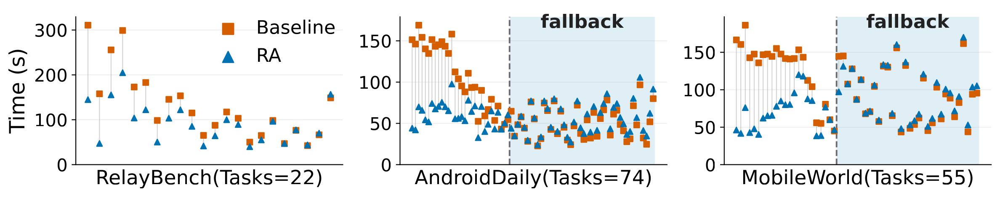
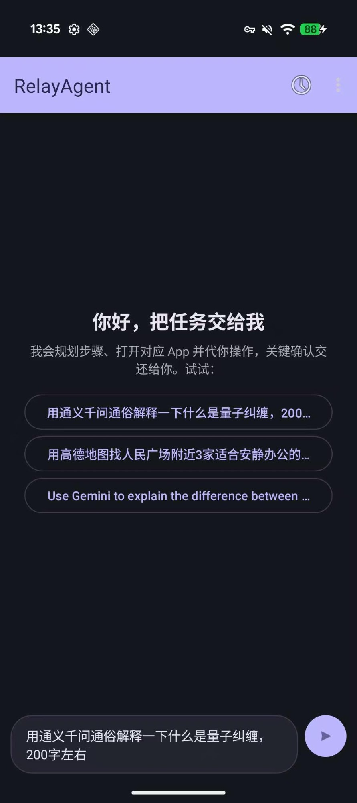

<h1 align="center">RelayAgent</h1>

<p align="center">
  <b>RelayAgent 是一个移动端 Agent：它将用户请求分解为子任务，然后**委派给 App 内置助手**（In-App AI Assistant，例如千问助手、小红书点点、微信 AI 助手、Google Gemini）来完成整个用户请求。</b>
</p>

<p align="center">
  <a href="#-引用">📚 论文</a> •
  <a href="android/README.md">📱 Android App</a> •
  <a href="docs/roadmap.zh.md">🗺️ 路线图</a> •
  <a href="CONTRIBUTING.md">🤝 参与贡献</a>
</p>

<p align="center">
  <a href="README.md">English</a> | <b>中文</b>
</p>

<p align="center">
  
  
  
  
</p>

<p align="center">
  
  <br>
  <em>RelayAgent 架构：先将任务拆解，再把每个子任务委派给对应的 App 内置助手</em>
</p>
<p align="center">
<table width="100%">
<tr>
<td align="center" valign="top" width="50%">
  <video src="https://github.com/user-attachments/assets/83339c29-4247-44a8-bc0a-ac1af3c4b066" width="410" autoplay loop muted playsinline></video>
  <br>
  <em><b>搜索附近高分餐厅并打车前往</b><br>小红书 → 高德地图</em>
</td>
<td align="center" valign="top" width="50%">
  <video src="https://github.com/user-attachments/assets/bd3a50fc-7d0c-40ee-b38d-0f7cb23469a7" width="410" autoplay loop muted playsinline></video>
  <br>
  <em><b>点三杯蜜雪冰城蜜桃四季春</b><br>→ 千问助手下单</em>
</td>
</tr>
</table>
</p>

---

## 📖 简介

RelayAgent 由两个部分组成：

- **🧭 基于委派的核心执行流**： 将主任务分解为 App 内可完成的子任务，每个子任务路由给相应 App 内置助手执行；若无助手可完成，则由 GUI Agent 通过逐步截图/执行的方式来兜底。
- **📚 动态能力卡片（Capability Card）**： 将 App 内置助手建模为能力卡片（YAML manifest），描述调用方式与能力边界，并据此进行子任务的路由。

### 与 API 方案和纯 GUI Agent 方案的对比

|  | 厂商 API<br>(A2A / App Intents / AppFunctions) | 纯 GUI Agent<br>(Mobile-Agent、AppAgent…) | RelayAgent（本项目） |
| --- | --- | --- | --- |
| 任务执行 | App 暴露的 API | 由 Agent 驱动的用户模拟行为 | App 内置助手 + 由 Agent 驱动的用户模拟行为 |
| 厂商配合 | 必须 | 不需要 | 不需要 |
| 覆盖面 | 窄（只有已发布的接口） | 任意 App | 任意 App |
| 速度 | 快 | 慢 | 较快 |
| Token 成本 | 无 | 高 | 低 |

<p align="center">
  
  <br>
  <em>纯 GUI Agent：每步一次截图 + VLM 往返</em>
  <br><br>
  
  <br>
  <em>RelayAgent：将任务委派给 App 内置助手</em>
  <br><br>
  
  <br>
  <em>左：RelayAgent；右：纯 GUI Agent</em>
</p>

## 🚀 快速开始

开启 USB 调试的安卓手机（当前能力卡片仅支持 Google Pixel 9）或模拟器，需安装并启用 ADB Keyboard 输入法（`com.android.adbkeyboard/.AdbIME`）。详见 [真机配置](docs/device_setup.zh.md) 和 [模拟器测试](docs/emulator_testing.zh.md)。

```bash
git clone https://github.com/ShadowNearby/RelayAgent.git && cd RelayAgent
uv venv --python 3.12 && uv sync --no-install-project --extra dev
cp .env.example .env
# 修改 .env 中的 LLM_BASE_URL / LLM_API_KEY / LLM_MODEL
uv run python scripts/validate/check_device_env.py    # 检查运行环境
uv run python scripts/run_plan.py --yes "帮我点三杯蜜雪冰城蜜桃四季春"
```

### 运行测试

```bash
uv run python -m unittest discover -s tests -v            # 无设备；单元测试
uv run python scripts/run_benchmark_test.py               # 有设备；运行端到端测试，包含 Baseline 和 RelayAgent
```

## 📊 测试结果

RelayAgent 在三个测试集（AndroidDaily、MobileWorld、RelayBench）上均优于纯 GUI Agent Baseline（MobileWorld 的 `general_e2e`）：

- 成功率提高 6–15 个百分点
- 端到端速度约为 Baseline 的 1.4–2 倍
- token 消耗约为 Baseline 的 1/7–1/10

<p align="center">
  
  <br>
  <em>任务完成率。浅蓝 = 无 Fallback 的 RelayAgent，蓝 = RelayAgent，橙 = GUI Agent Baseline</em>
  <br><br>
  
  <br>
  <em>任务完成时间。蓝 = RelayAgent，橙 = Baseline GUI Agent；阴影区为通过 GUI Agent 兜底完成的任务。</em>
  <br><br>
  
  <br>
  <em>任务 token 消耗</em>
</p>

## 📱 Android App

将规划、路由、执行、日志全流程运行在**Android App** 里，见 [`android/`](android/README.md)，在[`Release`](https://github.com/ShadowNearby/RelayAgent/releases)中下载 App。

<p align="center">
  
</p>

## 📚 文档

- [核心流程的架构](docs/nl_flow.zh.md)
- [能力卡片规范](docs/manifest_conventions.zh.md)
- [真机测试环境搭建](docs/device_setup.zh.md) / [模拟器测试环境搭建](docs/emulator_testing.zh.md)
- [Android App](android/README.md)
- [路线图](docs/roadmap.zh.md)

### 📇 支持的参考能力卡片

10 个 App · 50 个 App 内置助手能力（高德、通义千问、携程、Gemini、小红书、微信、WPS、Reddit、Booking.com、Microsoft Copilot）。详见 [docs/cards.zh.md](docs/cards.zh.md)。

## 📚 引用

如果 RelayAgent 对你有帮助，请引用论文与本仓库：

```bibtex
@misc{relayagent2026,
  title        = {RelayAgent: Mobile Task Automation by Delegating Subtasks to In-App AI Assistants},
  author       = {Yan, Jingsheng and Wu, Fangnuo and Dong, Mingkai and Chen, Haibo},
  year         = {2026},
  howpublished = {\url{https://github.com/ShadowNearby/RelayAgent}},
  note         = {Preprint; arXiv release upcoming}
}
```

## 🙏 致谢

- [**MobileWorld**](https://github.com/Tongyi-MAI/MobileWorld)（Tongyi MAI）—— 所用测试集之一，也是 GUI Agent Baseline 的来源。
- **AndroidDaily** —— 所采用的测试集之一。

## 📄 License

Apache 2.0，见 [LICENSE](LICENSE)。
